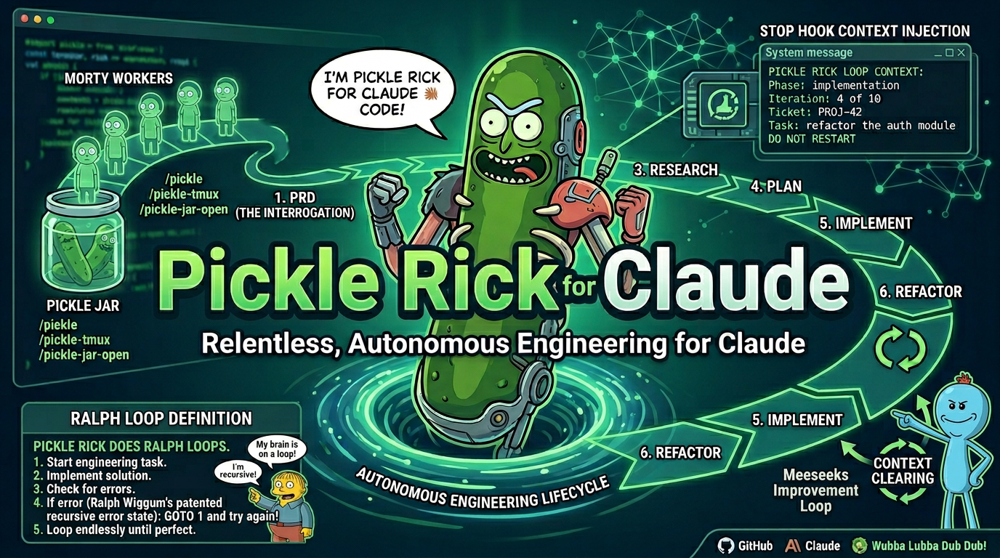

<p align="center">
  
</p>

# 🥒 Pickle Rick for Codex

> *"Wubba Lubba Dub Dub! I'm not just an assistant anymore, Morty — I'm an autonomous engineering machine jammed into Codex."*

Pickle Rick is a PRD-driven engineering workflow for Codex. Hand it a task or an existing `prd.md`, and it drives the work through a concrete lifecycle:

`PRD -> refinement -> ticket execution -> status/metrics -> retry/cancel`

This port is intentionally narrower than the Claude version. That is deliberate. The guaranteed v1 path is a Node runtime orchestrating sequential `codex exec` runs with filesystem-backed state under `~/.codex/pickle-rick/`. Anything beyond that, especially hooks and native multi-agent behavior, is treated as optional and validation-gated instead of being hand-waved into the contract.

If you want the short version: this repo gives Codex a real Pickle Rick persona, a global install path, a practical workflow, and a runtime that can carry a feature from vague task to reviewed ticket execution without pretending unsupported Codex features are stable. ⚗️

## What This Port Actually Does

- Installs a global Pickle Rick persona into Codex
- Installs Pickle Rick skills into `~/.codex/skills`
- Drafts PRDs with machine-checkable acceptance criteria
- Refines PRDs into ticket manifests and per-ticket markdown files
- Executes tickets sequentially in the current branch working tree
- Supports detached tmux orchestration with a runner window and live monitor
- Supports a detached `pickle-pipeline` path that runs `pickle`, then optional `anatomy-park`, then optional `szechuan-sauce` in one tmux session
- Supports detached context-clearing loops for `pickle-tmux`, `pickle-microverse`, `szechuan-sauce`, and `anatomy-park`
- Tracks runtime state, session mappings, metrics, and circuit-breaker state
- Supports safe cancel and retry flows without destructive rollback

## What It Does Not Promise

- It does not assume undocumented native agent controls
- It does not require project-local install to work
- It does not rely on hooks for the default path
- It does not claim feature parity with the Claude repo's broader command set

## Quick Start

### Requirements

- Node.js `>=20`
- `codex` installed and authenticated
- Git available in the target repo

### Install Globally

```bash
git clone https://github.com/gregorydickson/pickle-rick-codex.git
cd pickle-rick-codex
bash install.sh
```

That install does three things:

1. Copies the runtime to `~/.codex/pickle-rick/`
2. Copies Pickle Rick skills to `~/.codex/skills/`
3. Merges managed Pickle Rick marker blocks into `~/.codex/AGENTS.md` and `~/.codex/CLAUDE.md`

After that, the Pickle Rick persona is available in Codex generally. You do not need to reinstall it per project.

### Optional Project Override

Only use project bootstrap if you explicitly want repo-local Pickle Rick instructions or repo-local skill copies:

```bash
bash install.sh --project /path/to/project
```

That keeps the global install, and also adds managed Pickle Rick files to the target repo without deleting unrelated project-local Codex configuration. The installed runtime carries the source `.codex/skills` and `.codex/hooks` trees it needs, so the documented `~/.codex/pickle-rick/install.sh --project ...` path works after the first global install too.

Optional hooks remain opt-in:

```bash
bash install.sh --project /path/to/project --enable-hooks
```

## How To Build Things With It

This is the real workflow. You do not need to memorize every command. You need to understand the loop.

### Step 1: Draft A PRD

Every serious feature starts with a PRD. Open Codex in your repo and ask Pickle Rick to turn the rough task into something verifiable.

Examples:

```text
Use the pickle-prd skill to draft a PRD for caching loan status API responses in Redis.
```

```text
Use the pickle skill and continue from the existing prd.md in this repo.
```

The important part is not the markdown file. The important part is that the PRD ends with machine-checkable acceptance criteria instead of vague aspirations and hand-wavy “done when it feels done” nonsense. 🧪

### Step 2: Refine The PRD Into Tickets

Once the PRD exists, refinement turns it into execution material:

- `analyst-requirements.md`
- `analyst-codebase.md`
- `analyst-risk.md`
- `prd_refined.md`
- `refinement_manifest.json`
- ticket markdown files under per-ticket directories

This is where broad intent gets narrowed into atomic work that can be run in order, verified, retried, and inspected later. The Codex port now does this through a real three-analyst review pass followed by a synthesis step, instead of a single blind rewrite.

### Step 3: Execute Tickets Sequentially

The orchestrator runs tickets in manifest order. For each ticket it:

1. works directly in the current branch working tree
2. runs the ticket through the worker loop
3. verifies outputs
4. advances state or stops on policy

The point is not “maximum chaos.” The point is controlled sequential autonomy. Each ticket works on the branch as it exists now, carries forward prior ticket changes naturally, and still records explicit session artifacts and verification results.

For longer runs, launch the detached tmux version instead of keeping the current session occupied:

```text
Use the pickle-tmux skill with --prd ./prd.md so the runtime refines the PRD, launches detached, and gives me a tmux monitor I can reattach to later.
```

If the work should move through the full proven multi-phase path, use the dedicated detached pipeline entrypoint instead:

```text
Use the pickle-pipeline skill with "ship the feature" so the runtime launches one tmux session, runs pickle first, then advances through anatomy-park and szechuan-sauce when those phases are enabled.
```

### Step 4: Inspect, Retry, Or Cancel

Pickle Rick is not a black box. The runtime exposes state and recovery tools:

- `pickle-status` for the current session snapshot
- `pickle-metrics` for usage and activity reporting
- `pickle-retry` to safely re-run a ticket
- `pickle-cancel` to stop the active session without destructive rollback

### Step 5: Optional Polish Loops

Two advanced surfaces are included for targeted cleanup after the main loop:

- `pickle-microverse` for metric-convergence work
- `szechuan-sauce` for principle-driven code cleanup
- `anatomy-park` for subsystem correctness tracing

## The Flow At A Glance

```text
You describe a feature
       │
       ▼
  pickle-prd
       │
       ▼
  pickle-refine
       │
       ▼
  pickle-orchestrate
       │
       └── or pickle-tmux for detached tmux mode
       │
       ├── status / metrics while running
       ├── retry if a ticket fails
       └── cancel if you want the loop stopped safely
       ▼
  optional polish
       ├── pickle-microverse
       └── szechuan-sauce
       ▼
  ship it 🥒
```

## Skill Surface

The current Codex install exposes these primary skills:

- `pickle` — end-to-end autonomous loop
- `pickle-pipeline` — detached multi-phase pipeline across `pickle`, `anatomy-park`, and `szechuan-sauce`
- `pickle-tmux` — bootstrap from a PRD or resume a prepared session in detached tmux
- `pickle-prd` — draft a PRD
- `pickle-refine` — run three analyst passes, synthesize the result, and decompose the PRD into tickets
- `pickle-orchestrate` — execute the manifest sequentially
- `pickle-status` — inspect current runtime state
- `pickle-metrics` — session, token, commit, and LOC reporting
- `pickle-cancel` — cancel the active session safely
- `pickle-retry` — retry a failed or current ticket safely

Detached advanced loops currently present in the repo:

- `pickle-microverse`
- `szechuan-sauce`
- `anatomy-park`

### 🏥 Anatomy Park — Deep Subsystem Review

<p align="center">
  
</p>

> *"Welcome to Anatomy Park! It's like Jurassic Park but inside a human body. Way more dangerous."*

`anatomy-park` is the correctness loop. Use it when a subsystem keeps breaking, when IDs or schemas drift across boundaries, or when the code is technically "clean" but still wrong. It is about tracing data flow, finding where meaning changes, fixing one high-severity issue at a time, and documenting trap doors so the next pass does not walk into the same structural hazard.

<p align="center">
  
</p>

`pickle-microverse` is the metric-convergence loop. Use it when you can define a measurable objective and want iterative improve-or-revert behavior rather than one-shot implementation. It now launches as a detached tmux loop with fresh Codex context per iteration.

<p align="center">
  
</p>

`szechuan-sauce` is the principle-driven cleanup loop. Use it after implementation when the code works but still needs a deliberate pass for simplification, duplication cleanup, and consistency. It now launches as a detached tmux loop with fresh Codex context per iteration.

## Direct Runtime Commands

If you want the guaranteed path without relying on skill invocation, use the runtime directly:

```bash
node ~/.codex/pickle-rick/bin/pickle-pipeline.js "<task>"
node ~/.codex/pickle-rick/bin/pickle-pipeline.js --resume
node ~/.codex/pickle-rick/bin/pickle-tmux.js --prd ./prd.md
node ~/.codex/pickle-rick/bin/pickle-tmux.js --resume
node ~/.codex/pickle-rick/bin/pickle-microverse.js --metric "<cmd>" --task "<task>"
node ~/.codex/pickle-rick/bin/szechuan-sauce.js <target>
node ~/.codex/pickle-rick/bin/anatomy-park.js <target>
node ~/.codex/pickle-rick/bin/setup.js "<task>"
node ~/.codex/pickle-rick/bin/draft-prd.js <session-dir> "<task>"
node ~/.codex/pickle-rick/bin/spawn-refinement-team.js <session-dir>
node ~/.codex/pickle-rick/bin/mux-runner.js <session-dir> --on-failure=retry-once
```

Support commands:

```bash
tmux attach -t pickle-<session-id>
node ~/.codex/pickle-rick/bin/status.js
node ~/.codex/pickle-rick/bin/metrics.js --weekly
node ~/.codex/pickle-rick/bin/cancel.js
node ~/.codex/pickle-rick/bin/retry-ticket.js --ticket <ticket-id>
```

For pipeline sessions, `status.js` prints the active pipeline phase, per-phase status summary, bootstrap source, and target path while preserving the existing non-pipeline status output.

`pickle-tmux` has two first-class modes now:

- `--prd <path>` or `--bootstrap-from <path>`: create a detached session from an existing PRD, run refinement if needed, then launch tmux
- `--resume [session-dir]`: relaunch an existing session after validating that the manifest exists and there is at least one runnable ticket

## Session Model

Runtime state is persisted under `~/.codex/pickle-rick/`, including:

- session directories
- activity logs
- metrics inputs
- current session mappings
- state snapshots
- refinement manifests
- ticket artifacts

The design is deliberately file-backed so runs can resume and be inspected outside the model loop.

## Install Layout

Global install:

- `~/.codex/pickle-rick/` — runtime, scripts, docs
- `~/.codex/pickle-rick/.codex/skills/` — bundled source skill definitions used by the installed `install.sh --project ...` path
- `~/.codex/pickle-rick/.codex/hooks/` — empty default hook contract plus the opt-in project hook template
- `~/.codex/pickle-rick/tests/` — installed regression tests referenced by the package `test` script
- `~/.codex/skills/` — globally available Pickle Rick skills
- `~/.codex/AGENTS.md` — managed Pickle Rick persona block
- `~/.codex/CLAUDE.md` — compatibility mirror

Optional project override:

- `<project>/.codex/skills/` — repo-local skill copies
- `<project>/AGENTS.md` — managed Pickle Rick block merged into project instructions
- `<project>/CLAUDE.md` — compatibility mirror merge
- `<project>/.codex/hooks/hooks.json` — only when `--enable-hooks` is used

## Hooks

Hooks are not part of the guaranteed path.

The repo ships local handlers for:

- `SessionStart -> bin/session-start.js`
- `Stop -> bin/stop-hook.js`
- `PreToolUse -> bin/config-protection.js`
- `PostToolUse -> bin/log-commit.js`

The installed runtime ships `.codex/hooks/hooks.json` as an empty fail-open contract and `.codex/hooks/hooks.template.json` as the opt-in project template rendered by `bash install.sh --project <path> --enable-hooks`. The default install still does not enable project hooks automatically. Use hooks only when you explicitly want them and the installed Codex build has been validated to fire the events you care about.

## Validated Behavior

Validated locally on April 19, 2026 against `codex-cli 0.120.0`:

- `bash install.sh` installs the runtime, persona, and skills globally
- `~/.codex/pickle-rick/install.sh --project <path> [--enable-hooks]` works from the installed runtime because the source `.codex` tree is shipped with it
- a clean `codex exec` probe in a temp directory returned `Pickle Rick`
- the PRD and refinement flows can detect success artifacts and exit promptly even if the child Codex process lingers
- `pickle-pipeline` launches one detached tmux session, records immutable pipeline metadata, and advances through the configured phases with `pipeline-runner.log` in the monitor pane
- `status.js` renders pipeline metadata for pipeline sessions without changing legacy non-pipeline status output
- `pickle-tmux --prd ./prd.md` bootstraps, refines, and launches detached tmux instead of requiring a task-string workaround
- zero-ticket detached runs fail closed with `last_exit_reason = "no_tickets"` instead of marking the session complete
- detached tmux launchers for `pickle-tmux`, `pickle-microverse`, `szechuan-sauce`, and `anatomy-park` are covered by local tests with a fake `tmux` binary
- the runtime test suite passes on the checked-in code

Validation details live in [docs/codex-api-validation.md](docs/codex-api-validation.md).

## Repo Structure

- [AGENTS.md](AGENTS.md) — canonical persona and install contract
- [CLAUDE.md](CLAUDE.md) — compatibility mirror
- [bin](bin) — runtime entrypoints
- [lib](lib) — runtime internals
- [.codex/skills](.codex/skills) — installed skill definitions
- [tests](tests) — regression coverage
- [images](images) — README assets
- [docs/codex-api-validation.md](docs/codex-api-validation.md) — local validation notes

## Development

```bash
npm test
node ./bin/validate-codex.js
bash install.sh
```

The installed runtime now includes the `tests/` directory referenced by `package.json`, so `npm test` is truthful both in the repo and after install.

If you change install behavior, persona wiring, or runtime completion detection, update the tests and the validation doc in the same change.
